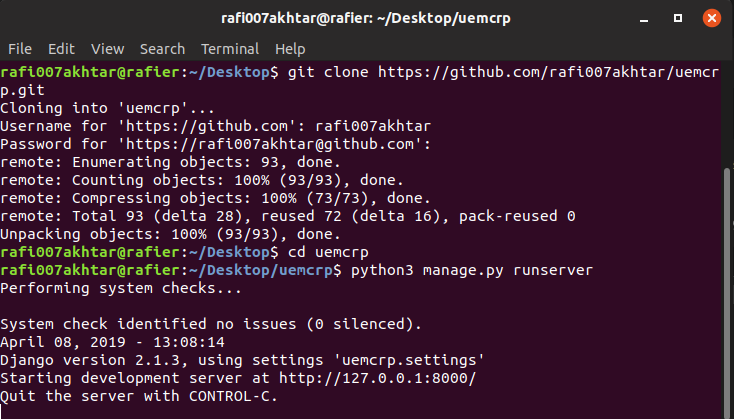
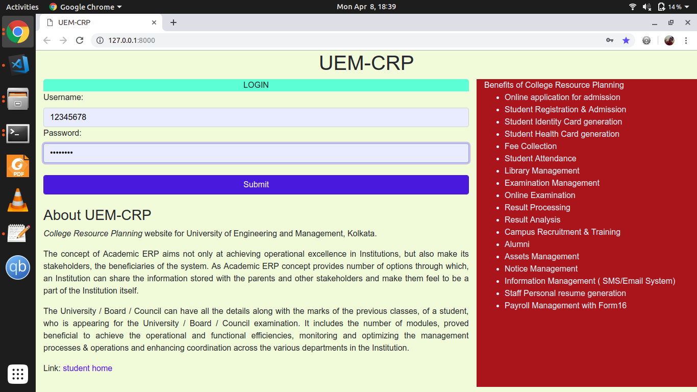
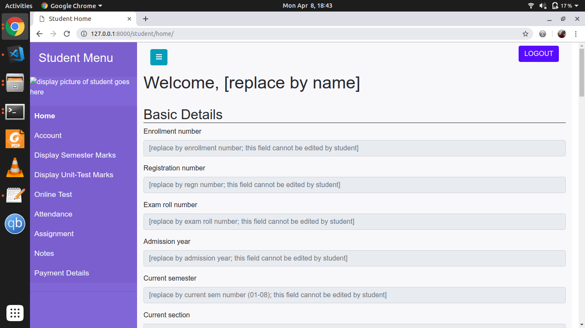

# uemcrp
Dummy CRP website for UEM for the final year project.

<!-- To-do list:
- [x] Home page
- [x] Student page
- [ ] profile page
- [x] set my password
- [ ] payment details
- [ ] display sem marks
- [ ] display unit marks
- [ ] online test
- [ ] attendance
- [ ] assignment
- [ ] notes

More to be added soon -->

## Prerequisites

Before running this project, make sure you have the follows.

### Linux users
1. Python 3.4 or above installed
2. Django 1.9 or above installed

### Windows users
1. Python 3.4 or above installed and added to path. [[Intallation link]](https://www.python.org/downloads/release/python-373/)
2. Please install [git bash](https://git-scm.com/download/win) or [cmder (full)](https://cmder.net/) because command-line work will be needed.
3. Use either of these two tools to install Django. Open whichever terminal you chose to install, and enter the following command
	```sh
	pip install Django
	```

And now you should be good to go.

## Running this project
1. **Windows user:** Open git bash or cmder. <br>
**Linux user:** Open terminal

2. Enter the following command to clone this repository.
	```sh
	git clone https://github.com/rafi007akhtar/uemcrp.git
	```

3. Enter the repository
	```sh
	cd uemcrp
	```

4. Run the project.
	```sh
	python manage.py runserver
	```
	If that command didn't work, try replacing `python` with `python3`, keeping rest of the command intact.
	
	The above 3 steps are visualized below in a Linux terminal.
	

5. Open your web-browser and go to the following URL:
	```
	http://127.0.0.1:8000/
	```

The app is now up and running, and should look like this.


## Sample login

The following credentials are made by me for sample login.
- `user-id:` 12345678
- `password:` rafi1234

Enter the above credentials, as shown below.


Now hit the `SUBMIT` button to login.

On logging, the page should look like this (for now; more features coming soon).


---
